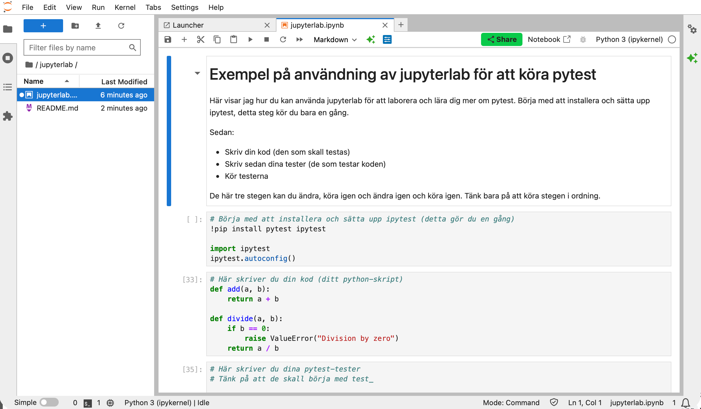

# jupyterlab

[Jupyterlab](https://jupyter.org) är en miljö där man kan skriva, experimentera och laborera med Python. Man skriver kod som i små block och kan köra varje block i vilken ordning man vill.

I denna katalog hittar du en fil, `jupyterlab.ipynb` som är en *notebook* för Jupyterlab. Notebooken visar hur du kan använda Jupyterlab för att skriva kod och sedan skriva testerna och köra testerna, från en och samma vy. Ganska smidigt!

